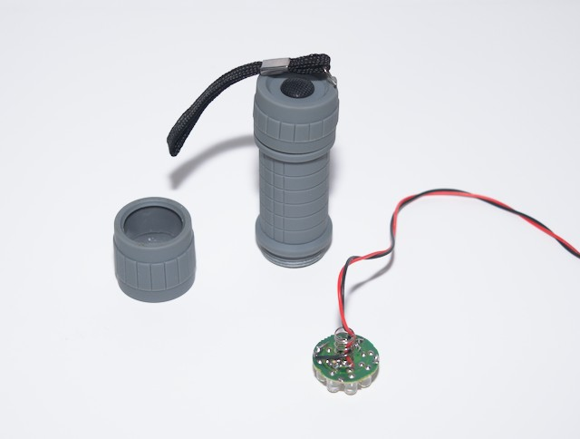
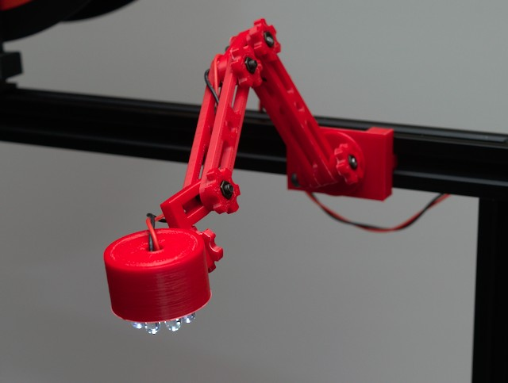
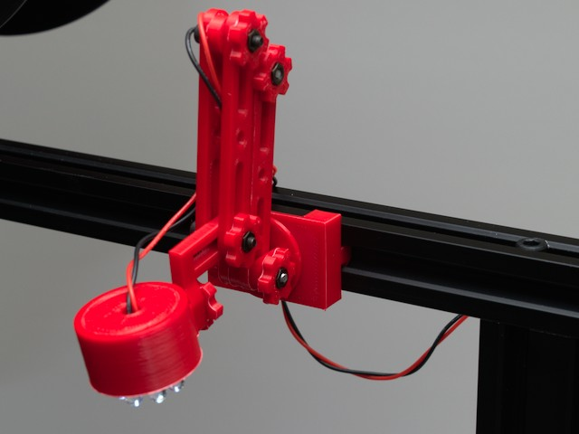
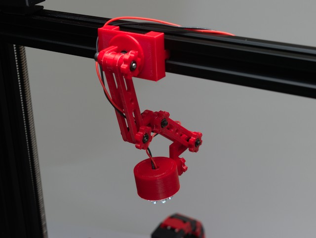
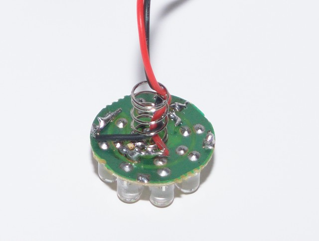
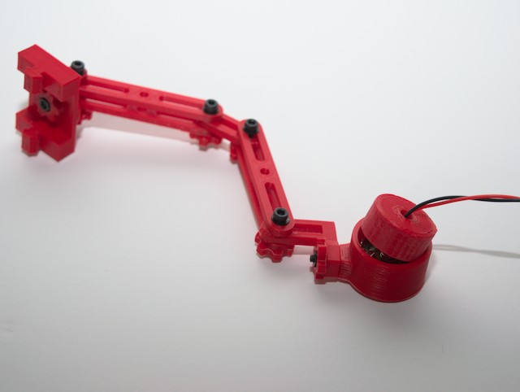

3D Printable Articulating Slot Rail Light
===

Description
---
Re-task a dollar store flashlight to be used as a light for your printer.  

* Fully articulates
* Fits and 2020 slot rail, slides easy.
* Can easily be wired to an LM2596 being used to power a Raspberry pi if you are running octoprint. 
* Folds up to low profile 

|  |  |
| --- | --- | 
|  |  |

### Also Published

[Thingiverse](https://www.thingiverse.com/thing:3955011)

### Sources

This is a remix of MrMartiniMo's camera mount from Thingiverse  
[https://www.thingiverse.com/thing:2600704](https://www.thingiverse.com/thing:2600704)

Safety
---
Please be sure to follow standard saafety precautions when working with anything electrical. 

Most printers run on a 24V power supply so you will need to provide your own step down converter.  
*i.e. If you use Octoprint and have a Raspberry Pi on your printer you can power the LED and the Pi from the same step down converter.*

Be sure you understand how to properly calculate current and wattage, ensure that the resistor you use can handle the load provided. 

Print Execution
---

### Settings

| Setting | Value | 
| --- | --- | 
| Material | ABS |
| Filament Brand | Hatchbox | 
| Supports | no |
| Infill | 20% | 

*This was printed in ABS to match another part not because it was required.* 

Post Print 
---

### Construction

1. Disassemble the flashlight
2. Pass the wires through the spring and solder to the correct leads on the flashlight head as shown *(fig 1)*
3. Assemble the arm as shown and press the cap into the head. (be sure the fit is not too tight if you plan on taking it out) *(fig 2)*
4. Connect to an appropriate power supply.

|  |  |
| :---: | :---: |
| *fig 1* | *fig 2* |

